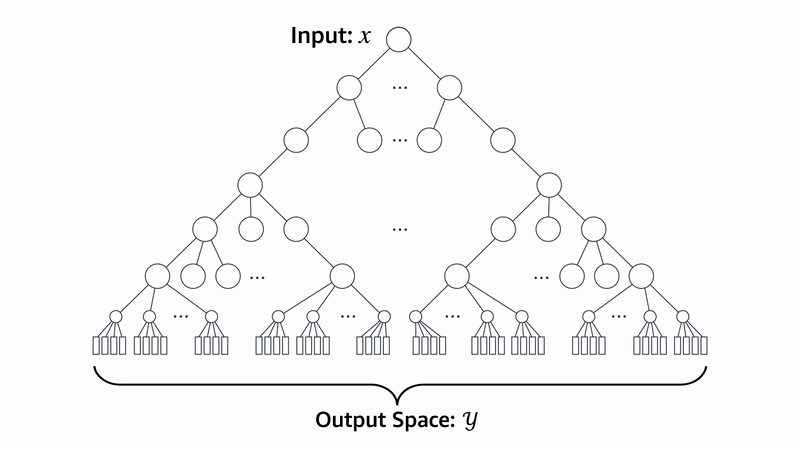

# Hypersonic: Intelligent Agent Implementation

This repository contains the implementation of an intelligent agent for the **Hypersonic** game. The project demonstrates the use of advanced search algorithms and heuristics to create an agent capable of competing effectively in the game.  

The project is implemented entirely in **C++** to ensure high performance and efficient computation, crucial for real-time decision-making in a competitive environment. This competition is part of [CodinGame's Hypersonic Bot Programming Challenge](https://www.codingame.com/multiplayer/bot-programming/hypersonic).  

## Game Overview
Hypersonic is a strategic multiplayer game where 2 to 4 players compete on a grid. The game involves placing bombs to destroy boxes, collect items, and eliminate opponents. Players are ranked based on survival and the number of boxes destroyed.

### Key Rules:
1. The grid consists of floors, walls, and boxes. 
2. Players can move or place bombs, which explode after 8 turns.
3. Items dropped from boxes can enhance players' abilities.
4. Players have full visibility of the game state and opponents' moves.
5. The winner is the last player standing or the one who destroys the most boxes in case of a tie.

## Game State Representation
The game state is a critical component of the agent's decision-making process. It provides a snapshot of all relevant elements in the game at a given moment.

### Components of a Game State:
1. **Map**: A representation of the grid, including walls, boxes, and empty spaces.
2. **Players**: Details of each player:
   - Current position
   - Number of bombs available
   - Explosion range of bombs
3. **Bombs**: List of all bombs in the game, including:
   - Position on the grid
   - Timer before explosion
   - Explosion range
   - The player who placed the bomb
4. **Items**: List of collectible items on the map, including:
   - Item type (e.g., bomb range, additional bomb)
   - Position on the grid
5. **Parent and Child States**:
   - **Parent State**: The state from which the current state was derived.
   - **Child States**: States generated from the current state based on possible actions.

## Hypersonic Search Tree
The agent uses a **Search Tree** to explore possible game states and determine optimal moves. 

### Structure of the Search Tree:
1. **Initial State**: Represents the starting configuration of the game.
2. **Nodes**: Each node corresponds to a game state.
3. **Edges**: Represent the legal moves made by players.
4. **Levels**: Each level simulates a single round of the game.

### Search Algorithm:
- The agent employs **Beam Search**:
  1. Expands a fixed number of top states (e.g., 150) at each level based on evaluation metrics.
  2. Simulates 8 levels, representing 8 rounds of the game.
  3. Backtracks from the best state at the deepest level to determine the optimal move.

## Transition Model
The **Transition Model** describes how the game state evolves as a result of player actions.

### Key Operations:
1. **Bomb Explosion**:
   - Decrements the timer for all bombs.
   - Triggers explosions for bombs with a timer of 0, affecting:
     - Players within the explosion radius.
     - Boxes (destroyed and potentially revealing items).
     - Adjacent bombs (chain reaction).
2. **Player Position**:
   - Updates the player’s position based on the selected move.
3. **Item Collection**:
   - If a player moves to a cell containing an item, it is collected.
   - Effects depend on the item type (e.g., increased bomb range).
4. **Bomb Placement**:
   - If a bomb is placed, it is added to the list of bombs.

## Game State Evaluation
To evaluate the quality of a game state, the agent uses several **heuristic metrics**:

1. **Player Position**:
   - Proximity to boxes (with or without items).
   - Proximity to available items.
   - Distance from other players.
   - Distance from the center of the map.

2. **Bomb Position**:
   - Strategic placement for maximum impact.
   - Avoiding blast zones for survival.

3. **Survival**:
   - Ensures the agent prioritizes moves that maximize survival chances.

### Evaluation Formula:
- The evaluation of a child state combines:
  - The parent state’s score (to preserve long-term strategy).
  - Scores based on the metrics described above.

## Project Results
The agent demonstrates intelligent behavior by selecting moves that maximize survival and box destruction. It has achieved **top positions in the gold league standings**.
